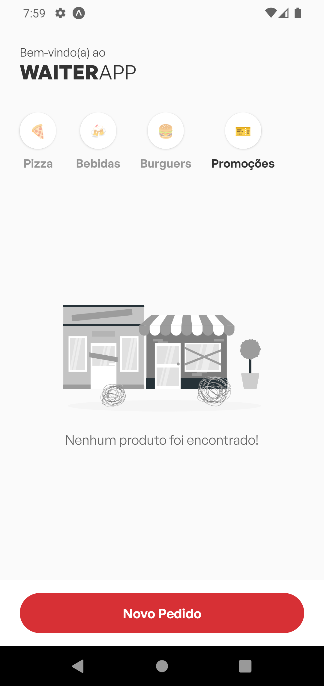

# Waiter App

### Projeto criado durante o evento <strong>O Poder do Javascript</strong> ministrado pelo <strong>Mateus Silva</strong> onde foi desenvolvida uma plataforma web e mobile com backend onde podemos gerenciar pedidos internos em restaurantes.
<br>


<hr>

<p align="center">
  <a href="#-tecnologias-utilizadas">Tecnologias</a> -
  <a href="#-resultado-aplicação-web">Resultado WEB</a> -
  <a href="#-resultado-aplicação-mobile">Resultado MOBILE</a> -
  <a href="#-como-executar">Como executar</a> -
  <a href="#-contato">Contato</a>
</p>

<a id="-tecnologias-utilizadas"></a>

## Tecnologias utilizadas

<p align="center">
  <a href= "https://html5.org/"></a>
  <a href= "https://developer.mozilla.org/pt-BR/docs/Web/CSS"></a>
  <a href= "https://styled-components.com/"></a>
  <a href= "https://www.javascript.com/"></a>
  <a href= "https://www.typescriptlang.org/"></a>
  <a href= "https://babeljs.io/"></a>
  <a href= "https://nodejs.org/en/"></a>
  <a href= "https://reactjs.org/"></a>
  <a href= "https://vitejs.dev/"></a>
  <a href= "https://reactnative.dev/"></a>
  <a href= "https://expo.dev/"></a>
  <a href= "https://axios-http.com/"></a>
  <a href= "https://www.sqlite.org/index.html"></a>
  <a href= "https://www.docker.com/"></a>
  <a href= "https://www.figma.com/file/IBaKjqTi23ai3kkJ5XdMcN/Bol%C3%A3o-da-Copa-(Community)-(Copy)"></a>
  <a href= "https://code.visualstudio.com/download"></a>
  <a href= "https://eslint.org/"></a>
</p>

<p align="center">
  <a href= "https://www.linkedin.com/in/israelnazareth/"></a>
  <a href= "https://instagram.com/raeldotjs"></a>
  
  
</p>

<a id="-resultado-aplicação-web"></a>

## :computer: Resultado Aplicação WEB


<hr>

<hr>


<a id="-resultado-aplicação-mobile"></a>

## :iphone: Resultado Aplicação Mobile

<p align="center">





<a id="-como-executar"></a>

## :white_check_mark: Como executar

Para executar as aplicações seguir os procedimentos abaixo:

-   API;
-   WEB;
-   MOBILE.

### - Iniciando o backend -

-   Acessar primeiro o diretório server com o comando

```bash
cd api
```

-   Instalar as dependências do backend

```bash
npm install
```
ou
```bash
yarn
```

-   Iniciar o backend com o comando

```bash
npm run dev
```

Com o backend rodando você pode escolher entre a aplicação WEB ou MOBILE

### - Iniciando aplicação WEB -

-   Acessar primeiro o diretório web com o comando

```bash
cd frontend
```

-   Instalar as dependências da aplicação WEB

```bash
npm install
```
ou
```bash
yarn
```

-   Iniciar a aplicação web com o comando

```bash
npm run dev
```

### - Iniciando aplicação MOBILE -

-   Acessar primeiro o diretório mobile com o comando

```bash
cd mobile
```

-   Instalar as dependências da aplicação MOBILE

```bash
npm install
```
ou
```bash
yarn
```

-   Iniciar a aplicação mobile com o comando

```bash
npx expo start
```
ou
```bash
yarn start
```
-   Inserir o IP da sua máquina no arquivo `api.ts` na pasta `utils`.

<br>
<br>

<a id="-contato"></a>

## :email: Contato

Meu nome é Israel, sou desenvolvedor web formado pela [Trybe](https://www.betrybe.com/) sempre em busca de novos conhecimentos e impactar positivamente a vida das pessoas.

-   Email: israel.fab@hotmail.com
-   Portfólio: [israelnazareth.github.io](https://israelnazareth.github.io/)
-   LinkedIn: [Israel Nazareth](https://www.linkedin.com/in/israelnazareth/)

## :smile: Agradecimento especial

### Ao [Mateus Silva](https://br.linkedin.com/in/mateusilva/)

<a href="https://br.linkedin.com/in/mateusilva/" target="_blank">
  
</a>

E sua equipe por terem proporcionado esse evento de muita qualidade e aprendizado.
